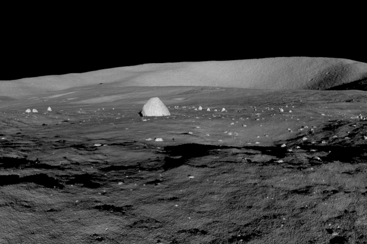
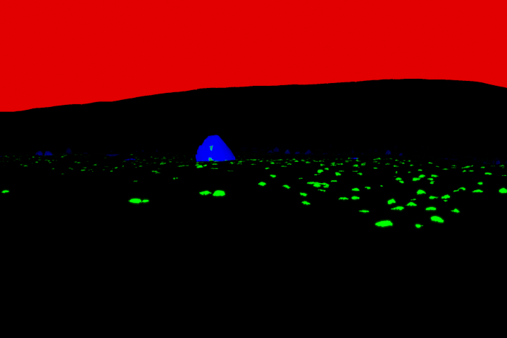
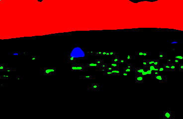

# Moon Data

## Goal:
The goal of this kernel was to train a CNN to be able to segment simulated moon images and perform multi-class classication of:
* Large rocks
* Small rocks
* Sky
* (+Background)

The trained model was later used to perform segmentation in real moon images.

## Procedure:

We trained the network using an encoder-decoder architecture, with several convolution, maxpooling and batch-normalization layers. 

Finally, for the decoder, we used concatenation and transposed convolution layers.

The last layer of the network was a convolution layer with dimensionality equal to the number of classes (3 in this case).

## Results:

### Input image:

### Input mask:

### Output mask:

